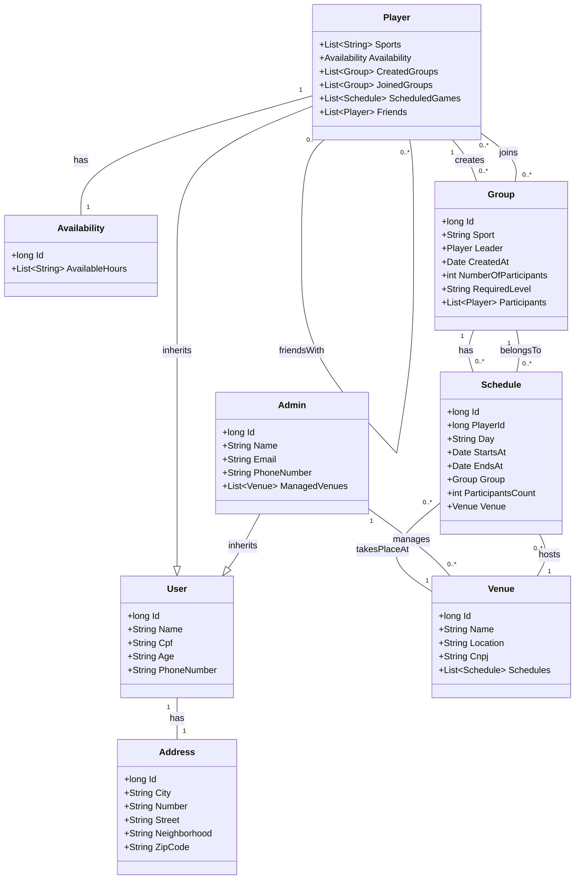

# 📌 Database Schema - Sports Management System

Este repositório contém o diagrama do banco de dados para um sistema de gerenciamento de esportes. O sistema permite que jogadores criem grupos, agendem partidas e administradores gerenciem estabelecimentos esportivos.

## 📊 Diagrama do Banco de Dados (Mermaid)

## 🏗️ Estrutura das Entidades

### 🔹 User
- **Id**: long (PK)
- **Name**: String
- **Cpf**: String
- **Age**: String
- **PhoneNumber**: String

### 🔹 Address
- **Id**: long (PK)
- **City**: String
- **Number**: String
- **Street**: String
- **Neighborhood**: String
- **ZipCode**: String

### 🔹 Availability
- **Id**: long (PK)
- **AvailableHours**: List<String>

### 🔹 Player (Herda de User)
- **Sports**: List<String>
- **Availability**: Disponibilidade (FK)
- **CreatedGroups**: List<Group>
- **JoinedGroups**: List<Group>
- **ScheduledGames**: List<Schedule>
- **Friends**: List<Player>

### 🔹 Group
- **Id**: long (PK)
- **Sport**: String
- **Leader**: Player (FK)
- **CreatedAt**: Date
- **NumberOfParticipants**: int
- **RequiredLevel**: String
- **Participants**: List<Player>

### 🔹 Schedule
- **Id**: long (PK)
- **PlayerId**: long (FK)
- **Day**: String
- **StartsAt**: Date
- **EndsAt**: Date
- **Group**: Group (FK)
- **ParticipantsCount**: int
- **Venue**: Venue (FK)

### 🔹 Admin (Herda de User)
- **Id**: long (PK)
- **Name**: String
- **Email**: String
- **PhoneNumber**: String
- **ManagedVenues**: List<Venue>

### 🔹 Venue
- **Id**: long (PK)
- **Name**: String
- **Location**: String
- **Cnpj**: String
- **Schedules**: List<Schedule>

## 🔗 Relacionamentos
- **User** tem um **Address** (1 para 1)
- **Player** tem uma **Availability** (1 para 1)
- **Player** pode criar vários **Groups** (1 para muitos)
- **Player** pode participar de vários **Groups** (muitos para muitos)
- **Player** pode ter vários **Friends** (muitos para muitos)
- **Group** tem vários **Schedules** (1 para muitos)
- **Schedule** pertence a um **Group** (muitos para 1)
- **Schedule** acontece em um **Venue** (muitos para 1)
- **Admin** gerencia vários **Venues** (1 para muitos)
- **Venue** tem vários **Schedules** (1 para muitos)

